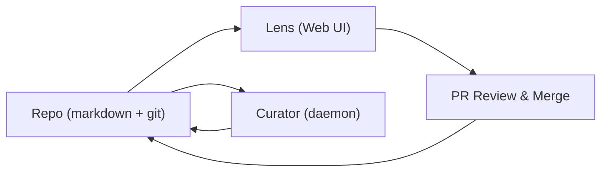

# piqay

[piqay](https://github.com/edeustace/piqay) is the tooling suite this org uses to keep
the knowledge base alive. The repository *is* the source of truth; piqay renders it,
lets us browse it, and helps us review changes without the files getting in each
other's way.

## Tools

| Tool | Purpose |
|---|---|
| **Lens** | Web UI for browsing, searching, and commenting on this repo |
| **Curator** | Background daemon that keeps docs fresh and cross-linked |

## How it's used here

- The repo is markdown + git. Comments live in TOML sidecars (`*.md.comments`),
  next to the doc they're about — the source stays clean, the discussion is still
  version-controlled.
- Comments anchor to specific lines (a content hash), so they survive edits. If the
  line changes, the comment shows a `stale` badge instead of silently pointing at
  the wrong content.
- Everything is a PR. Change here, review in Lens, merge to `main`.

## Architecture

## See also

- The daily workflow is in `docs/how-we-use-lens.md`.
- [Who we are](./who-we-are.md)